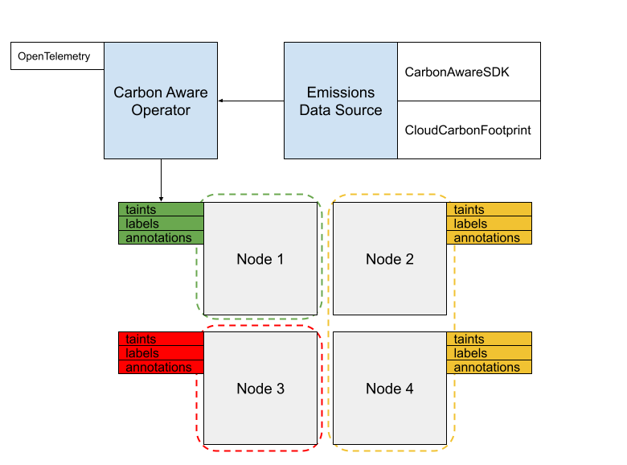

# Carbon Hack 22
- [hackathon website](https://taikai.network/gsf/hackathons/carbonhack22)
- [idea board](https://docs.google.com/document/d/14VQZwFe-Q8bxf1TbsNNOXfTT37BFGVfUfk0MzP7rE6c/edit#heading=h.68fgvwg50ibg)
- [Carbon Aware SDK](https://github.com/Green-Software-Foundation/carbon-aware-sdk)

## Proposal: Carbon Aware Operator



One way to extend a k8s cluster is to use the [operator pattern](https://kubernetes.io/docs/concepts/extend-kubernetes/operator/), which allows administrators to define custom resources that interact with other cluster resources in novel ways. We propose that one use of this pattern is to automatically apply labels to k8s nodes which enable carbon aware operations policies to be implemented. 

Consider a hypothetical k8s cluster with autoscaling node pools in 3 regions: A, B and C. The Carbon Aware Operator has gathered data from the Emissions Data Source and determined that region C is the least green. It applies a [taint](https://kubernetes.io/docs/concepts/scheduling-eviction/taint-and-toleration/) to the nodes in region C:

```yaml
# ...
taints:
- key: greensoftware.foundation/carbon-intensity
  value: high
  effect: NoSchedule
```

Now, if resources are submitted to the scheduler, they will not be scheduled on any nodes in region C unless they provide a matching toleration:

```yaml
# ...
tolerations:
- key: greensoftware.foundation/carbon-intensity
  operator: Equal
  value: high
  effect: NoSchedule
```

With this we have a way of using a built-in k8s mechanism to bring carbon awareness to our daily operations. In addition to taints, the CAO could be configured to apply labels to nodes, allowing [node (anti-)affinity](https://kubernetes.io/docs/concepts/scheduling-eviction/assign-pod-node) to be carbon aware as well.

The intended way to use the tool would be to configure a set of taints and/or labels that would allow you to naturally move workloads from dirty regions to clean ones. Once utilization of dirty regions is low or gone, you can remove it from your configs entirely.

There are several outputs to this project:
1. Carbon Aware Operator
   - helm chart w/ CRD & controller
   - config to provide granular control over labelling policies
   - expose OpenTelemetry metrics for the cluster's carbon intensity, maybe based on resource labels
2. Emissions Data Source interface
   - There are a growing number of data sources for cloud carbon emissions. It would be good to have a distilled interface which can be fulfilled by a number of backing APIs. Ideally works with gRPC.
3. Resource labels
   - stable keys and values for node taints, labels, and annotations
   - This is the main interface for cluster users; the keys and values will be how users configure tolerations and affinities.
   - ex:
     - "greensoftware.foundation/carbon-intensity": "high", "medium", or "low"


## Usage
Install prereqs:
  - [go >=1.18](https://go.dev/dl/)

```
# dev
go mod download
go run .
./scripts/verify.sh

# run
docker build -t my.repo/cao:latest .
helm install cao k8s/cao --set image=my.repo/cao:latest
```

## Brainstorm
- carbon aware operations in k8s
  - CRDs: carbon aware cluster extensions
    - applying taints to nodes in dirty regions
    - auto scaler
    - Deployment wrapper
  - scheduler plugin: bake carbon awareness into the control plane
    - score nodes based on carbon intensity
    - ref
      - https://kubernetes.io/docs/concepts/scheduling-eviction/kube-scheduler/
      - https://kubernetes.io/docs/concepts/scheduling-eviction/scheduling-framework
      - https://medium.com/@juliorenner123/k8s-creating-a-kube-scheduler-plugin-8a826c486a1
      - https://github.com/kubernetes-sigs/scheduler-plugins/blob/master/doc/install.md
      - https://kubernetes.io/docs/tasks/extend-kubernetes/configure-multiple-schedulers/
      - https://github.com/kubernetes-sigs/scheduler-plugins

### Nodes
GKE labels
  - topology.gke.io/zone=us-central1-b
  - topology.kubernetes.io/region=us-central1
  - topology.kubernetes.io/zone=us-central1-b


